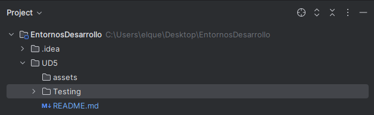
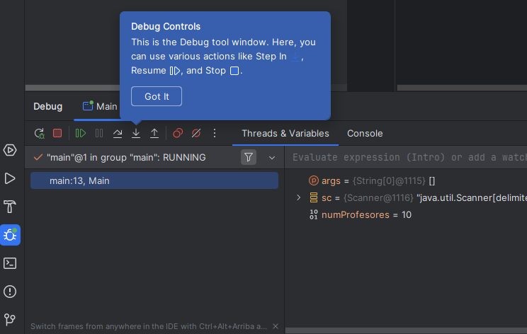
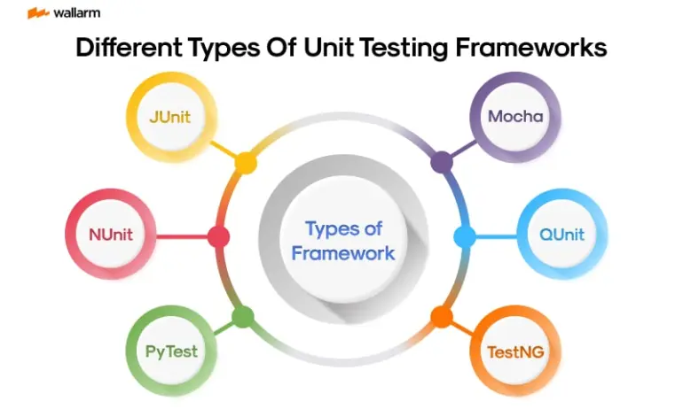
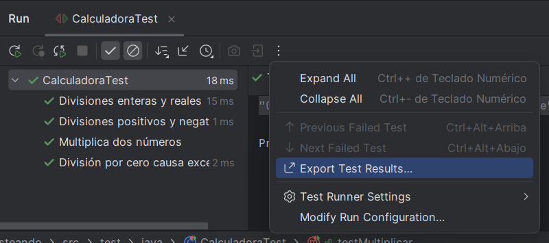

# UD5 Testing

## Introducción

Autor: Miguel Ángel Quevedo Reinoso

[Tema 5](https://pamariniesfranciscodelosrios.github.io/EDpublic/)

## 1.-Testing

Glosario Importante

1.**Caso de prueba.** Conjunto de entradas, condiciones de ejecución y salidas esperadas diseñadas para un objetivo concreto. Los casos de pruebas forman parte de las pruebas a un software.

2.**Fiabilidad.** Probabilidad de que un software cumpla con su función sin errores durante un tiempo determinado. Cuanto más fiable sea un software, mejor.

3.**MD5.** Sigla del inglés message digest algorithm 5 (algoritmo de reducción criptográfico). También llamado función hash, sirve para saber si algún dato, archivo o información han sido modificados.

4.**Prueba de regresión.** Prueba automatizada que puede servir para corroborar, tras la modificación de un software, que todo va a funcionar como debería.

5.**Release.** Versión definitiva de un software que puede comercializarse o distribuirse.

6.**RTF.** Sigla de revisión técnica formal. Revisión realizada por el auditor y el desarrollador de software a un programa o sistema.

7.**SQA.** Sigla del inglés software quality assurance. Más conocido como control de calidad.

8.**Tester o ingeniero de pruebas.** Profesional independiente del equipo de desarrollo, que suele ser programador y poseer amplios conocimientos en informática. Su función es participar en la fase de pruebas de un sistema.

9.**Versión alfa.** Primera fase de la versión de un software. Cuando está en fase alfa, el software se prueba en un entorno y características determinadas y controladas por el desarrollador. No es una versión definitiva.

## 2.-Pruebas

### 2.1.-Formas de las pruebas

Existen dos enfoques principales para realizar pruebas:

* **Pruebas dinámicas**: se ejecuta la aplicación para observar cómo se comporta.
* **Pruebas estáticas**: no requieren ejecutar el código; se revisa directamente.

### 2.2.-Estragegias de prueba

Podemos diferenciar dos grandes estrategias:

#### Estrategias de prueba de caja negra

Evalúan el funcionamiento del sistema sin considerar su implementación interna.

#### Estrategias de prueba de caja blanca

Se centran en la estructura interna del código para verificar que todos los caminos posibles se ejecutan correctamente.

### 2.3.-Tipos de pruebas

Las pruebas se dividen en dos grandes categorías:

* **Funcionales**: verifican si el software cumple los requisitos establecidos.
* **No funcionales**: evalúan características como el rendimiento, la seguridad, etc.

#### Pruebas funcionales

* Pruebas Unitarias (o de unidad)
* Pruebas de regresión
* Pruebas de integración
* Pruebas de humo (smoke test)
* Pruebas del sistema
* Pruebas alfa y beta
* Pruebas de aceptación

#### Pruebas no funcionales

* Pruebas de usabilidad
* Pruebas de rendimiento
* Pruebas de stress
* Pruebas de seguridad
* Pruebas de compatibilidad
* Pruebas de portabilidad

### 2.4.-Mecanismos de prueba

* **Manual**: el tester realiza las pruebas directamente.
* **Automático**: un software ejecuta los tests y compara los resultados con los esperados.

## 3.-Debug

El proceso de *debugging* o depuración permite ejecutar el programa paso a paso para encontrar y entender errores.

Se realiza en modo especial, conocido como **modo debug**, y es controlado por un programa llamado **debugger**.

Durante la depuración, se pueden establecer **puntos de ruptura** (breakpoints) que detienen la ejecución para analizar el estado del programa.

Entre las opciones disponibles durante la depuración están:

* Continuar hasta el próximo breakpoint o hasta el final.
* Ejecutar una sentencia y pasar a la siguiente.
* Entrar paso a paso en la ejecución interna de una sentencia.
* Salir del código interno y seguir con el nivel anterior.
* Finalizar el programa.

También se puede:

* Inspeccionar el valor de variables.
* Fijar valores o expresiones concretas.

## 4.-Framework

Algunos frameworks utilizados para realizar pruebas automáticas son:

* **.NET**: xUnit
* **Java**: JUnit, TestNG
* **C++**: CppUnit, Google Test
* **PHP**: PHPUnit
* **JavaScript**: Mocha

### 4.1. Automatización de pruebas

#### Anotaciones

En las clases de test creamos métodos que implementen los tests. Para ello hacemos uso de las siguientes anotaciones:

* `@Test`: Indica que el método es un test que se debe ejecutar.
* `@DisplayName("nombre")`: Personaliza el nombre con el que aparecerá el test en los resultados.
* `@Disabled`: Los métodos marcados con esta anotación no serán ejecutados.
* `@BeforeAll`: el método es invocado antes de iniciar todos los tests. Sólo puede haber un método con esta anotación.
* `@AfterAll`: el método es invocado después de finalizar todos los tests. Sólo puede haber un método con esta anotación.
* `@BeforeEach`: Se ejecuta antes de cada test.
* `@AfterEach`: Se ejecuta después de cada test.

#### Generar documentación

El IDE nos proporciona, al ejecutar los tests, la información de si estos se han llevado a cabo con éxito o no. Sin embargo, también podemos generar documentación en HTML o XML para compartir con otra persona.

Para ello hacemos clic en el botón "Export test results" seleccionamos el formato en el que queremos obtener la información.

#### Cobertura del código

La cobertura del código es una medida que indica qué porcentaje de código está cubierto por algún test. Un valor del 100% indicaría que todo el código es ejecutado alguna vez durante las pruebas. Es una de las métricas que se puede tener en cuenta a la hora de medir la **calidad** del software.

En IntelliJ, a la hora de ejecutar los test, podemos elegir hacerlo con cobertura. Ello hará que se nos muestre en un panel la cobertura de las clases, los métodos y las líneas de los elementos de nuestro proyecto. Además, nos resaltará en el IDE en color rojo o verde las líneas según no tengan o tengan cobertura (es decir, se ejecuten en algún test).

Respecto a la cobertura de código, también se nos permite generar un informe en HTML en el que podemos comprobar cuál es la cobertura del código de nuestra aplicación

Hemos realizado varios ejemplos de ChatGPT junto con el de la calculadora. [Ejemplos ChatGPT](https://chatgpt.com/share/67ecf921-2640-8003-b098-2170ab453d5d)